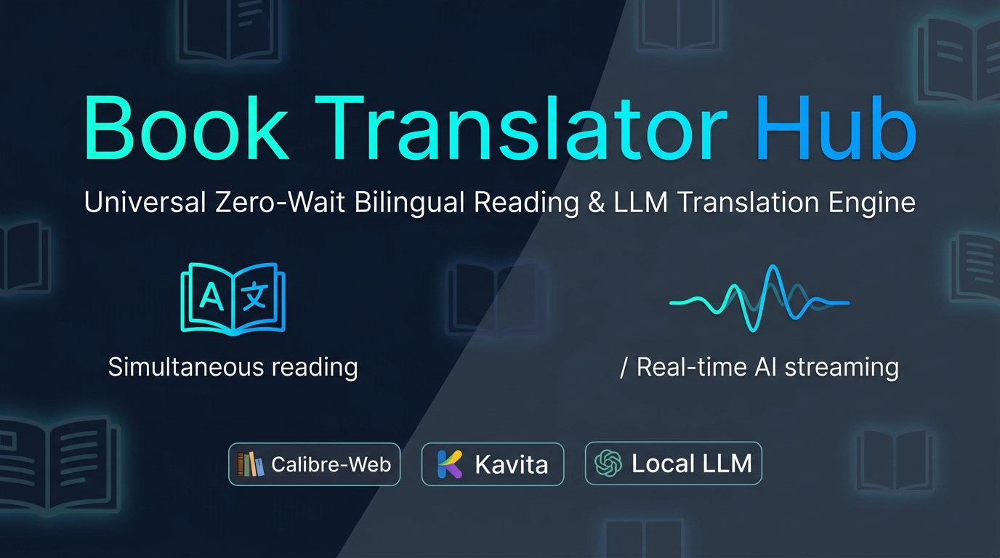
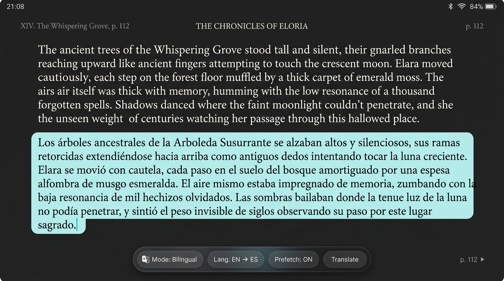
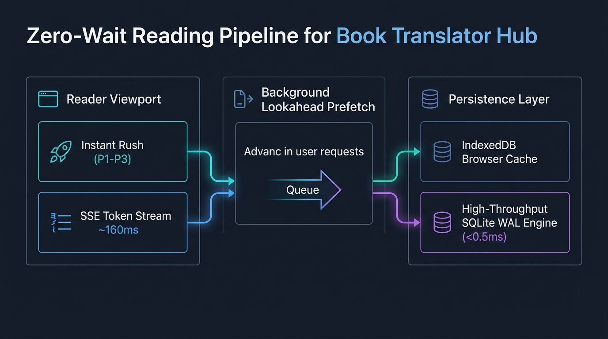

# Book Translator Hub

<p align="center">
  
</p>

<p align="center">
  <a href="https://github.com/felixapel/book-translator-hub/releases/latest"></a>
  <a href="LICENSE"></a>
  
  
  
  <a href="https://github.com/sponsors/felixapel"></a>
  <a href="https://ko-fi.com/felixapel"></a>
</p>

<p align="center">
  <b>Universal, zero-wait bilingual reading overlay and translation engine for Calibre-Web, Kavita, and self-hosted ebook libraries powered by local or cloud LLMs.</b>
</p>

---

<p align="center">
  
</p>

## ✨ What it does

- **Real-Time Token Streaming (SSE):** Translates the first visible paragraph with Server-Sent Events (SSE), streaming words into the reader DOM in **~160ms** as the LLM generates them.
- **Instant Viewport Rush:** Concurrently translates paragraphs 1, 2, and 3 in parallel micro-batches via Continuous Batching on local GPU (vLLM) or cloud providers.
- **Zero-Wait Directional Lookahead:** Intelligently pre-translates upcoming pages along the reader's directional trajectory for an instantaneous 0ms page-turn experience.
- **High-Capacity IndexedDB Cache:** Stores thousands of translated paragraphs offline directly in the browser (`BookTranslatorDB`), bypassing standard 5MB `localStorage` limitations.
- **High-Throughput SQLite WAL Engine:** Server-side cache tuned with 256MB memory-mapping (`mmap_size`) and 64MB RAM page cache for **sub-millisecond (<0.5ms)** lookups.
- **Dedicated E-Ink Mode:** 1-bit high-contrast layout without animations, blurring, or drop shadows, perfectly optimized for e-readers (Kindle, Kobo, Onyx Boox).
- **Universal Multi-Reader Support:** Seamless native integration with stock [Calibre-Web-Automated](https://github.com/crocodilestick/Calibre-Web-Automated) and pinned [Kavita](https://github.com/Kareadita/Kavita) EPUB readers without altering either upstream image.
- **Zero-Trust Privacy & Security:** Keeps all LLM API tokens and server endpoints strictly isolated on the internal network; no client-side credential leakage.

---

<p align="center">
  
</p>

---

<p align="center">
  
</p>

---

## 🚀 Supported installation

The production path is the universal `btctl` hub. It builds an immutable local
image from an exact clean checkout and runs CWA, Kavita or both through
one hardened container while keeping separate internal API processes, caches,
keys and cookies:

```bash
git clone https://github.com/felixapel/book-translator-hub.git book-translator-hub
cd book-translator-hub
git switch --detach v2.4.0
```

Copy the managed configuration outside the checkout and make it private:

```bash
install -d -m 0700 /absolute/private/path
cp .env.hub.example /absolute/private/path/book-translator-hub.env
chmod 0600 /absolute/private/path/book-translator-hub.env
```

Set each enabled reader's exact container, network, version, public origin and
storage paths. The template defaults to Google's stable, low-latency Gemini
model; add a server-side Google AI Studio or project API key and leave the
local URL empty:

```dotenv
BT_ENABLE_CWA=true
BT_ENABLE_KAVITA=true
LLM_PROVIDER=gemini
LLM_MODEL=gemini-3.5-flash-lite
LLM_API_KEY=<Google AI Studio or project API key>
BT_LOCAL_URL=
BT_BATCH_SIZE=10
BT_BATCH_SOURCE_TOKEN_BUDGET=450
BT_BATCH_MAX_TOKENS=1200
BT_CLIENT_PREFETCH_GAP_MS=1000
BT_MAX_BATCH_PARAGRAPHS=50
```

Named providers use their fixed HTTPS API endpoints. Local and custom
OpenAI-compatible backends are also supported through environment variables;
they are optional, not required fallbacks. Then run:

```bash
./btctl plan --env /absolute/private/path/book-translator-hub.env
./btctl install --env /absolute/private/path/book-translator-hub.env --yes
./btctl doctor --env /absolute/private/path/book-translator-hub.env
```

`plan` validates and reports the intended resources without changing the reader
or deployment state. `install` commits state only after live postconditions pass.
`doctor` is read-only and every check must report `ok`.

Provider roles are selected entirely through the private environment, with
shared defaults and optional per-reader overrides. The split profile retains
its provider-only `btctl reconfigure` workflow. A hub provider change uses a
reviewed `uninstall` with the old environment followed by `install` with the
new one; translation data is retained, hub-owned session keys are regenerated,
and all reader processes restart coherently, so tabs may require a fresh
short-lived session.
See the [configuration reference](docs/reference/configuration.md). A ChatGPT,
Codex, Gemini or Antigravity consumer subscription is not an API credential.

Stock Unraid requires root, Bash, Docker and a full checkout including `.git`.
It does not require host Python, host Git or NerdTools to run `./btctl`; the
launcher uses a temporary containerized operator when needed. Linux hosts use
`BT_INSTALL_PROFILE=compose-existing`. Operators who need independent
container isolation or CWA Authentik-forwarded identity can retain the split
profile.

Community Applications uses a separate CWA-only combined-image profile. Install
it only from a searchable listing whose template pins an immutable image digest;
if no listing is present, use `btctl`. See the
[Community Applications guide](docs/install/community-applications.md).

## 🛡️ Runtime boundary

```text
Browser / reverse proxy -> injection proxy -> stock CWA or Kavita
                                  |
                                  +-> private translation API -> LLM
                                                     |
                                                     +-> SQLite cache
```

Managed native-reader profiles exchange existing CWA or Kavita proof for a
short-lived, opaque translator session. Raw reader credentials are confined to
the exact exchange endpoint; ordinary translation calls never receive them.
CWA strong-session binding and Kavita native/OIDC login are supported within
their documented boundaries. Do not publish the API, disable authentication,
or add a route that bypasses the managed proxy. Advanced CWA Authentik
deployments have a separate fail-closed profile and guide.

CWA is the current stable release target. The stock Kavita v0.9.0.2 EPUB
connector is contract- and CI-certified in this checkout, but remains a
candidate until physical Unraid and real-reader browser acceptance is recorded.
Manga, PDF and library writeback are not supported.

## ⚡ High-Throughput Batching & Model Optimization

Empirical benchmarking across large language models has established optimal token economics for paragraph translation:

| Backend / Model | Avg Latency (20 paragraphs) | Parser Pass Rate | Recommended Batch Size |
| :--- | :---: | :---: | :---: |
| **Groq (`openai/gpt-oss-120b`)** | **1.03s** | **100%** | **20** |
| **Local vLLM (`gemma4-12b`)** | **2.34s** | **100%** | **20** |
| **Gemini (`gemini-3.5-flash-lite`)** | **0.61s - 3.5s** | **100%** | **20** |

### SQLite High-Concurrency WAL Engine
To eliminate database contention under concurrent batch reading, the SQLite cache runs in **Write-Ahead Logging (WAL)** mode:
```sql
PRAGMA journal_mode = WAL;
PRAGMA synchronous = NORMAL;
PRAGMA busy_timeout = 5000;
```
Response latency on cached paragraphs drops to **< 0.5ms**.

## 💖 Sponsors & Community Support

Book Translator Hub is 100% free and open-source software built for the self-hosted and reading communities. Development, local GPU testing (vLLM/Ollama), and continuous integration are maintained independently.

If you find Book Translator Hub valuable for your daily reading, please consider supporting the project:

<p align="center">
  <a href="https://github.com/sponsors/felixapel">
    
  </a>
  &nbsp;&nbsp;
  <a href="https://ko-fi.com/felixapel">
    
  </a>
</p>

* **Bug Bounties & Hardware:** Supports purchasing hardware for testing on physical E-Ink devices and running local GPU benchmarks.
* **Feature Requests:** Backers can directly influence the roadmap for future reader integrations (Audiobookshelf, Komga, Readium).

## 📖 Documentation

- [Documentation map](docs/README.md)
- [Universal CWA and Kavita hub](docs/install/universal-hub.md)
- [Managed `btctl` install](docs/install/btctl.md)
- [Kavita managed install](docs/install/kavita.md)
- [Community Applications](docs/install/community-applications.md)
- [Authentik integration](docs/install/authentik.md)
- [Lifecycle and recovery](docs/operations/lifecycle.md)
- [Troubleshooting](docs/operations/troubleshooting.md)
- [Compatibility](docs/reference/compatibility.md)
- [Configuration](docs/reference/configuration.md)
- [Architecture](docs/reference/architecture.md)

## 🤝 Development and support

Read [CONTRIBUTING.md](CONTRIBUTING.md) and the
[development guide](docs/maintainers/development.md) before changing the
project. Use the issue templates for reproducible bugs and feature proposals.
Report vulnerabilities through the private channel in [SECURITY.md](SECURITY.md).

Book Translator Hub is GPL-3.0 software with no telemetry, ads or subscription.
Support is optional through [Ko-fi](https://ko-fi.com/felixapel) or
[GitHub Sponsors](https://github.com/sponsors/felixapel). The project is not
affiliated with or endorsed by CWA, Kavita, Calibre, Google or any LLM provider.

See [LICENSE](LICENSE) for the license text.
